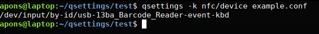

# qsettings
qsettings QT5 from shell scripts. Easy parse ini config files.

## Installation

    git clone https://github.com/alfredopons/qsettings.git
    cd qsettings
    qmake
    make
    sudo cp qsettings /usr/local/bin/

## Usage

    Usage: ./qsettings [options] filename
    qsettings for shell scripts. Easy parse for INI files.
    
    Options:
      -h, --help                 Displays this help.
      -v, --version              Displays version information.
      -k, --key <machine/taxes>  Specify the key to search
      -n, --no-newline           do not output the trailing newline
    
    Arguments:
      filename                   Config INI file (qsettings format).
  
  
## Example

My config file:

    active=true
    device=/dev/tty2
    type=460
    
    [lcd_screen]
    active=true
    address=39
    device=/dec/screen
    type=440
    
    [machine]
    barcode_pay=false
    free_pay=false
    nfc_pay=true
    nfc_pin_login_only_numeric=false
    nfc_pin_password_only_numeric=true
    nfc_pin_pay=true
    taxes=true
    type=0
    
    [nfc]
    active=true
    device=/dev/input/by-id/usb-13ba_Barcode_Reader-event-kbd
    type=600
    
    [printer]
    active=false
    device=auto
    type=200
    
    [theme]
    style=Material
    
    [tpv]
    active=false
    bus=0
    device=/dev/serial/by-id/usb-INGENICO_Ingenico_iUC285-if00
    type=800
    
    
Type:
    
    cd qsettings/test
    qsettings -k nfc/device example.conf
    

## License

The LGPL License (LGPL-3+)

Copyright (c) 2019 Alfredo Pons - apons@linucleus.com

This program is free software: you can redistribute it and/or modify
it under the terms of the GNU General Public License as published by
the Free Software Foundation, either version 3 of the License, or
(at your option) any later version.

This program is distributed in the hope that it will be useful,
but WITHOUT ANY WARRANTY; without even the implied warranty of
MERCHANTABILITY or FITNESS FOR A PARTICULAR PURPOSE.  See the
GNU General Public License for more details.

You should have received a copy of the GNU General Public License
along with this program.  If not, see <http://www.gnu.org/licenses/>.
